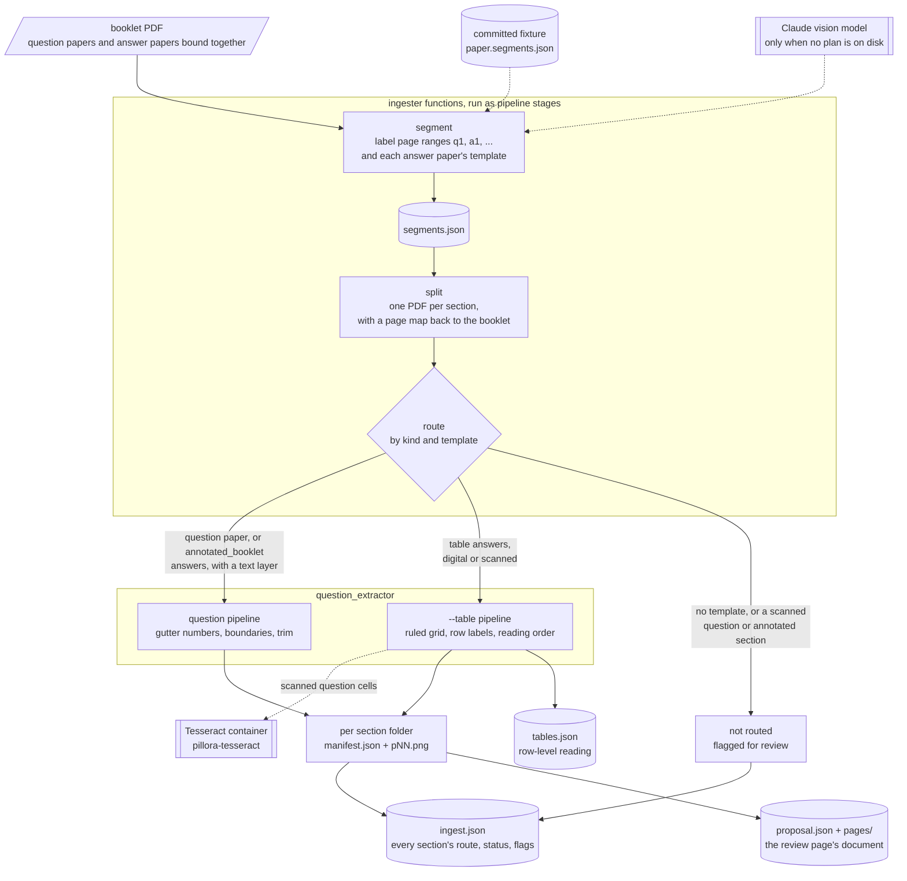

# Pillora Question Bank Ingester

Turns exam-paper PDFs into located questions, in three packages:

- **[`ingester`](ingester/README.md)** reads a downloaded booklet — question papers and
  their answer papers bound together — labels which pages are which with a vision model,
  and splits it into one PDF per paper.
- **[`question_extractor`](question_extractor/README.md)** finds each question inside one
  digital-text question paper and records the rectangle it occupies, drawing it in red on
  a whole-page render for checking by eye.

- **[`pipeline`](pipeline/README.md)** runs a booklet as a job of small, file-based stages,
  each a task in a store (`python -m pipeline submit|run|status|ingest`). It calls the other two
  packages' functions, so its artefacts match theirs. A stage boundary sits where an external
  dependency lives (the API, Tesseract), where a human may edit the artefact, or where the work
  is costly and separately useful; smaller steps stay function calls. `python -m pipeline ingest`
  runs a whole folder of papers through every stage (segment, split, each section's extraction, and
  the `report` stage's `ingest.json`); `python -m ingester ingest` is an alias for it. See
  [docs/adr/0001-stage-pipeline.md](../docs/adr/0001-stage-pipeline.md).

`python -m pipeline ingest` runs the whole chain on each booklet (as stage tasks, one worker):



```bash
python -m venv .venv
.venv/bin/pip install -e .                       # .venv/Scripts/ on Windows; or `pip install -e ./ingestion` from the repo root

python -m ingester segment paper.pdf --output-dir output/
python -m ingester split paper.pdf --output-dir output/
python -m question_extractor paper.pdf --output-dir output/
python -m pipeline submit paper.pdf && python -m pipeline run && python -m pipeline status
python -m pipeline ingest samples/ --recursive --output-dir output/   # a folder, one <paper>/ each; `ingester ingest` is the same
```

## The proposal

The `report` stage also writes `proposal.json`: the one document the webapp's review page reads
and the admin edits, plus `pages/pNN.webp`, the clean review image of every booklet page it
mentions (copied from each section's `review/pNN.webp`; `pNN` is the **booklet** page number, two
digits or more). Everything in it is in booklet terms: page numbers are booklet pages, rectangles
are PDF points on that page, image paths are relative to the job folder.

```
{
  "papers": [                       # one per question section, with its answer section
    {"label": "q1", "answer_label": "a1", "answer_template": "table",
     "pages": [{"page": 7, "image": "pages/p07.webp", "width_pt": 595.3, "height_pt": 841.9,
                "needs_review": false, "review_reason": null}],
     "questions": [{"number": 1,
                    "question_rects": [{"page": 7, "x0": 72.0, "y0": 100.0, "x1": 523.0, "y1": 160.0}],
                    "answer_rects":   [{"page": 23, "x0": 72.0, "y0": 100.0, "x1": 290.0, "y1": 160.0}],
                    "flags": []}],
     "orphan_answers": [{"page": 23, "x0": ..., "y0": ..., "x1": ..., "y1": ...}],
     "warnings": []}
  ],
  "unrouted": [{"label": "a2", "status": "not_routed", "reason": "...", "first_page": 31, "last_page": 36}],
  "warnings": []
}
```

- **Pairing.** A question section and the answer section with the same segment `index` (the
  segmenter's rule: "an answer paper takes its question paper's index") form one paper; `q1`↔`a1`
  in practice. `answer_label` is `null` when the booklet has no such answer section, and
  `answer_template` is that section's template (`table`, `annotated_booklet`, ...).
- **Pages.** `pages` holds the pages of the question section *and* its answer section (each page once,
  sorted by booklet page), the ones the extractor rendered; a page the extractor skipped (blank,
  end-of-paper) is not listed. `width_pt`/`height_pt` are the page's size as the review image shows
  it (rotation applied), so the image is `width_pt * 2` by `height_pt * 2` pixels (`review_zoom`).
  `needs_review` / `review_reason` are the manifest's. `image` is `null` (with a paper warning) if
  the review WebP could not be written.
- **Rectangles.** One entry per manifest rectangle, so a question spanning pages has several in
  `question_rects`. An answer rectangle goes in `answer_rects` of the question with the same
  `number`; one with no such question goes to `orphan_answers` (so nothing disappears). Every
  manifest rectangle of every extracted section appears exactly once.
- **Straightened scans.** On a scanned table page the manifest's rectangles are measured on the
  *straightened* page (rotated counter-clockwise by the page's `straightened.angle_deg` about its
  centre, recorded in that section's `manifest.json` `pages[]`). The proposal maps them back to the
  page as filed, which is what the review image shows and what a crop of the source PDF needs: the
  rectangle's corners are rotated back about the page centre, the axis-aligned bounding box taken,
  and clipped to the page. Every rectangle in the proposal lies inside its page.
- **Flags.** A question's `flags` are, without repetition: `page N: <reason>` for each page it
  touches that the extractor flagged for review (an answer page's reasons are added to the question
  it answers), `pixel_ink` (a rectangle whose bounds came from the pixels, not the text layer) and
  `grid_page` (a graph-paper page).
- **Unrouted.** Every section that was not extracted (`not_routed` or `failed`) is in `unrouted` with
  its reason and its booklet page range (`first_page`..`last_page`, what the review page's "handle
  manually" opens), whatever else the proposal does with it. A question section that was not extracted but
  whose answer section was still gets a paper: no `questions`, the answer rectangles in
  `orphan_answers` and a paper warning naming why (the scanned booklets whose answer key reads but
  whose question paper cannot be located). An answer section with no question section (an answer-only
  upload) is a paper with `label: null` and a top-level warning. A paper none of whose sections was
  extracted is omitted.

`report` declares the section manifests, the review folders and the plan as inputs and
`proposal.json` and `pages/` as outputs (and the `proposal_tolerance_pt` setting), so it reruns when any
section is redone.

Every command writes into `output/<paper name>/`. `samples/` is the regression corpus;
each package's README says how to check a change against it.

## OCR

Some papers are scans with no text layer. Tesseract runs in a container
(`ingestion/docker/tesseract/`), so the host needs only Docker. Its Debian base pins it to 5.3.0,
with the English model. Build the image once:

```bash
docker compose build tesseract    # from the repo root: the service lives in the root docker-compose.yml
```

**Scanned answer tables use it.** `question_extractor --table` (and `pipeline ingest`, for a
`table` section) reads a scanned key's question numbers by piping every question cell
of the section, as one multi-page TIFF, to `docker run --rm -i --network none
pillora-tesseract` (`question_extractor/ocr.py`). Nothing is mounted or written to disk.
With Docker stopped or the image not built, those pages come back flagged with the
reason; digital pages never call Docker. The command is a setting
(`ExtractConfig.ocr_command`, `--ocr-command` on `question_extractor --table` and
`pipeline ingest`/`ingester ingest`): `--ocr-command tesseract` runs the binary directly, as the
production container will, and reads the same. The question-cell crops are also a stage
artefact: `ocr.encode_cells` makes the multi-page TIFF and `ocr.read_tiff` reads it. Scanned *question* and `annotated_booklet`
sections are still left unrouted.

The container also runs on its own, e.g. to give page images a text layer:

```bash
docker compose run --rm tesseract output/p03.png stdout                    # plain text
docker compose run --rm tesseract pages.txt output/layer -c textonly_pdf=1 pdf
```

The second command writes `output/layer.pdf`, an invisible text layer with one page per
image listed in `pages.txt`. `ingestion/` is mounted at `/work` with no network, so give
paths relative to `ingestion/` (run these from the repo root; `output/` is `ingestion/output/`), in `pages.txt` too. In Git Bash an absolute path is
rewritten to a Windows one. Render pages with PyMuPDF's `get_pixmap(dpi=...)`, which
records the DPI in the PNG; the layer's pages then come out at the original page size,
and `Page.show_pdf_page` lays the layer over the scan with each word on its printed
text. No pipeline does this yet.
