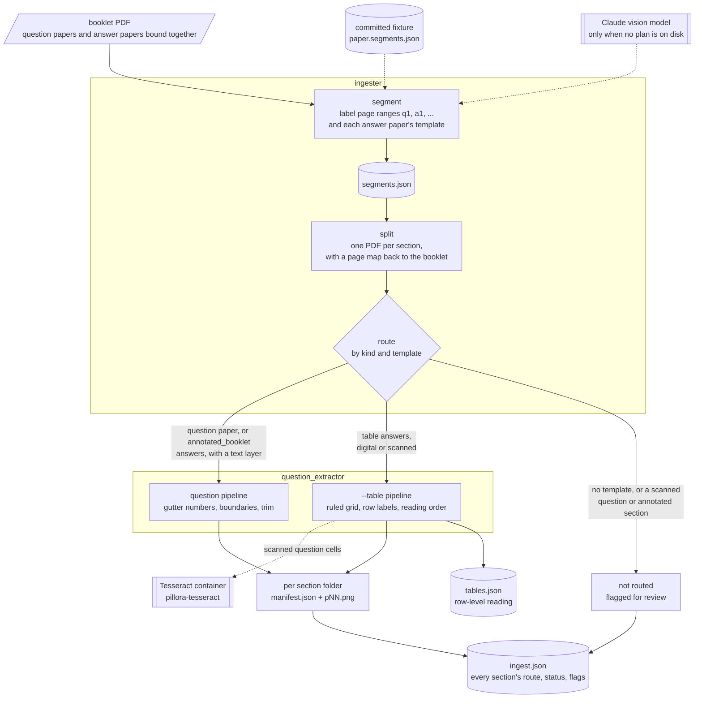

# Pillora Question Bank Ingester

Turns exam-paper PDFs into located questions, in two packages:

- **[`ingester`](ingester/README.md)** reads a downloaded booklet — question papers and
  their answer papers bound together — labels which pages are which with a vision model,
  and splits it into one PDF per paper.
- **[`question_extractor`](question_extractor/README.md)** finds each question inside one
  digital-text question paper and records the rectangle it occupies, drawing it in red on
  a whole-page render for checking by eye.

`python -m ingester ingest` runs the whole chain on a booklet:



```bash
python -m venv .venv
.venv/bin/pip install -e .                       # .venv/Scripts/ on Windows; or `pip install -e ./ingestion` from the repo root

python -m ingester segment paper.pdf --output-dir output/
python -m ingester split paper.pdf --output-dir output/
python -m question_extractor paper.pdf --output-dir output/
```

Every command writes into `output/<paper name>/`. `samples/` is the regression corpus;
each package's README says how to check a change against it.

## OCR

Some papers are scans with no text layer. Tesseract runs in a container
(`ingestion/docker/tesseract/`), so the host needs only Docker. Its Debian base pins it to 5.3.0,
with the English model. Build the image once:

```bash
docker compose build tesseract    # from the repo root: the service lives in the root docker-compose.yml
```

**Scanned answer tables use it.** `question_extractor --table` (and `ingest`, for a
`table` section) reads a scanned key's question numbers by piping every question cell
of the section, as one multi-page TIFF, to `docker run --rm -i --network none
pillora-tesseract` (`question_extractor/ocr.py`). Nothing is mounted or written to disk.
With Docker stopped or the image not built, those pages come back flagged with the
reason; digital pages never call Docker. The command is a setting
(`ExtractConfig.ocr_command`, `--ocr-command` on `question_extractor --table` and
`ingester ingest`): `--ocr-command tesseract` runs the binary directly, as the
production container will, and reads the same. The question-cell crops are also a stage
artefact: `ocr.encode_cells` makes the multi-page TIFF and `ocr.read_tiff` reads it. Scanned *question* and `annotated_booklet`
sections are still left unrouted.

The container also runs on its own, e.g. to give page images a text layer:

```bash
docker compose run --rm tesseract output/p03.png stdout                    # plain text
docker compose run --rm tesseract pages.txt output/layer -c textonly_pdf=1 pdf
```

The second command writes `output/layer.pdf`, an invisible text layer with one page per
image listed in `pages.txt`. `ingestion/` is mounted at `/work` with no network, so give
paths relative to `ingestion/` (run these from the repo root; `output/` is `ingestion/output/`), in `pages.txt` too. In Git Bash an absolute path is
rewritten to a Windows one. Render pages with PyMuPDF's `get_pixmap(dpi=...)`, which
records the DPI in the PNG; the layer's pages then come out at the original page size,
and `Page.show_pdf_page` lays the layer over the scan with each word on its printed
text. No pipeline does this yet.
