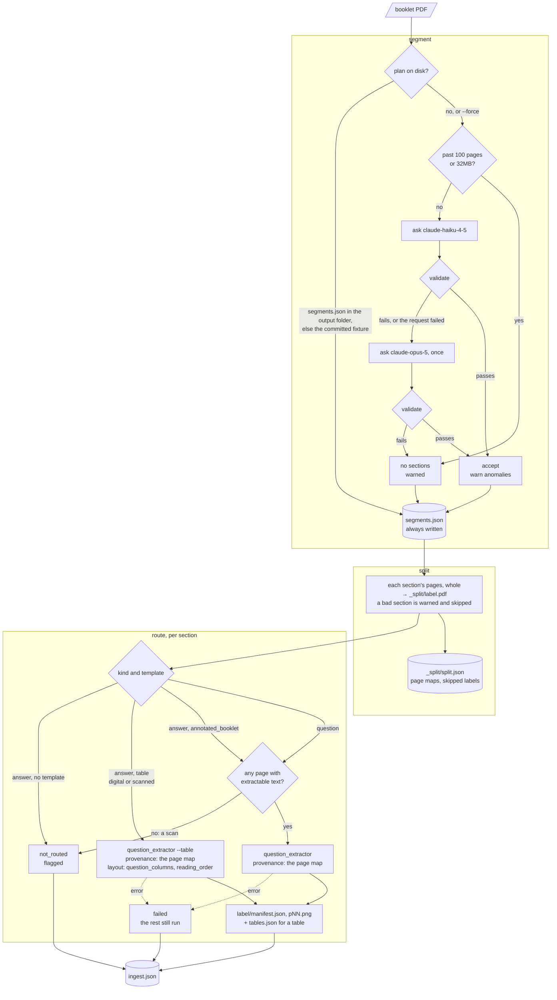

# Ingester

A PDF downloaded from a paper bank is rarely one paper: it is a question paper, often a
second behind it, and often each one's answer paper (marking scheme, worked solutions or
a bare answer key). `ingester` says which pages are which, so `question_extractor` can be
handed one paper at a time.

Two stages, each writing into `output/<paper>/`. Running both and routing what they produce
is `python -m pipeline ingest` (see [`pipeline/README.md`](../pipeline/README.md)); `python -m ingester
ingest` is kept as an alias that forwards its flags there:

```bash
# ask a vision model for labelled page ranges -> segments.json
python -m ingester segment <pdf|folder> --output-dir output/ [--force] [--write-fixture]
# cut the PDF along them -> _split/<label>.pdf and _split/split.json
python -m ingester split <pdf|folder> --output-dir output/
# segment + split + route each section -> <label>/ per section and ingest.json
# (an alias for `python -m pipeline ingest`; --review is accepted and a no-op, the review images are always written)
python -m ingester ingest <pdf|folder> --output-dir output/ [--force] [--recursive] [--debug] [--model M] [--retry-model M] [--ocr-command CMD]
```

```
output/<paper>/segments.json
output/<paper>/_split/<label>.pdf, split.json
output/<paper>/<label>/manifest.json, pNN.png   # one question_extractor run per routed section
                                                # (every run adds detections.json, or grid.json for a table;
                                                # a table section also adds tables.json)
output/<paper>/ingest.json                      # the paper-level report
```

The three stages, each step described below:



**Segments.** `q1`, `q2`… are question papers and `a1`, `a2`… their answer papers;
an answer paper takes its question paper's index. Pages are 1-based PDF positions
(not printed page numbers), inclusive. Front matter and trailing blank padding belong
to no range; a blank page *inside* a paper stays in its range.

**Templates.** Each answer section carries a `template`, which decides how it is
cropped downstream: `table` (answers tabulated, no question text) or
`annotated_booklet` (the question booklet with answers written in, so each page
carries question and answer). Question text being present is the deciding signal.
Question sections carry `null`. A section the model answers `unsure` about gets
`null` with `needs_review: true` and a warning, rather than a guess.

**Table layout.** A `table` section also carries `question_columns`, the 0-based
indices of the printed columns holding question numbers (`[0]`; `[0, 2]` for two
question-and-answer column groups side by side), and `reading_order`, `down` (each
group top to bottom, then the next) or `across` (row by row across the groups). Every
other section carries `[]` and `null`, and so does a table the model could not read
(`[]`/`none` in the reply). They are a hint for the table reader, which checks them
against the page (see `question_extractor/README.md`), not a measurement.

**The stage**, in order:

1. **Reuse.** Read `output/<paper>/segments.json`, else the committed fixture
   `<paper>.segments.json` beside the PDF (copied into the output folder). `--force`
   skips both; `--write-fixture` also writes the result as the fixture.
2. **Size.** A PDF past the 100-page `document` cap or the 32MB request limit is
   left unsegmented with a warning naming the cap — it is likelier the wrong file
   than a long paper, so it is not routed to a bigger model.
3. **Ask, validate, escalate.** `claude-haiku-4-5` answers; if the answer fails
   validation (or the request fails), `claude-opus-5` is asked once. Validation is
   the only thing that escalates.
4. **Write.** `segments.json` is always written, with `warnings`, `attempts`, the
   accepted `model` (null if none) and `source` (`model` or `hand`).

**Two thinking shapes.** Pre-4.6 models take `budget_tokens` thinking and reject
`effort`; later ones take adaptive thinking and reject `budget_tokens`. Each is a 400
on the wrong model. `legacy_thinking_prefixes` decides; unknown ids get the new shape.

**Validation** rejects an answer whole — a structure misread in one place says
nothing about the rest. Problems: a malformed label, a label disagreeing with its
kind/index, an index above `max_segment_index`, pages backwards or outside the
document, ranges out of page order or overlapping (a shared page would be extracted
twice), per-kind indices not numbered 1..n down the document, a template on a question
section, an answer section with no template (that it didn't flag as `unsure`), a
column layout on a question or `annotated_booklet` section, and a table layout that is
unusable: more than `max_question_columns` columns, an index that is negative or not
strictly ascending, or a reading order outside `down`/`across`. The response schema
cannot enforce those limits itself: structured outputs support no array-length or
numeric bounds.
**Anomalies** are accepted but warned: no sections at all, an answer paper with no
matching question paper, an answer section flagged for review, a table section with
no full layout (the reader measures what is missing), and pages between two sections
that none claims (usually the next paper's cover — or a section dropped entirely).

**Split.** `python -m ingester split <pdf|folder> --output-dir output/` reads the
plan the same way (output folder, then fixture; it never asks a model) and writes each
section's pages, whole, to `output/<paper>/_split/<label>.pdf`. `_split/split.json`
records each section's label, kind, template, range and `page_map` (split page →
original page, the map `SourceProvenance` takes), plus `skipped` labels and
`warnings`. `_split/` is replaced on every run. A section outside the PDF's pages, or
one that fails to write, is warned and skipped; the rest are still written. No plan,
or a plan with no sections, writes an empty `split.json` and a warning.

**Route.** `pipeline ingest` sends each split section to the pipeline that can crop its shape
(`router.choose_route`): a question section, and an answer section whose template is
`annotated_booklet` (each page carries question and answer, the shape the extractor was
built for), go through `question_extractor` with the split's page map as provenance,
so every page in the section's manifest also carries its `original_page`. A `table`
answer section goes through the table extractor (`question_extractor --table`) the same
way, with its `question_columns`/`reading_order` as the layout hint. That includes a
scanned table: the table extractor straightens it and reads its question numbers with
the Tesseract container, so Docker must be running with the image built (`docker
compose build tesseract`); without them its pages come back flagged, with the reason.
`--ocr-command tesseract` runs a locally installed binary instead of the container.
The output lands in `output/<paper>/<label>/` — the split PDF is named for its label —
and that folder is replaced on every run. Not routed, and recorded with the reason: an
answer section with no template (flagged for review), and a question or
`annotated_booklet` section none of whose pages has extractable text (a scanned paper;
flagged — the question extractor would only emit every page "for review", which reads
as a result when it is not one). A section that fails is recorded as `failed` and the
rest still run; a paper that fails does not stop a folder run. The walk over a paper's
sections is the pipeline's: `split` fans out each section's chain by `choose_route`, and
the `report` stage writes `ingest.json` from the artefacts.

`ingest.json` lists every section with `label`, `kind`, `template`,
`first_page`/`last_page`, `route` (pipeline name or null), `status` (`extracted`,
`not_routed`, `failed`), `reason`, `output` folder, `questions`, the extractor's
`warnings`, `needs_review` and `review_pages` (original-PDF pages the extractor
flagged), plus the segment and split stages' warnings and a paper-level `needs_review`.

## Design notes

**A model is asked only when no plan is on disk.** The output folder, then the
committed fixture, then a request. This keeps every later stage, and the regression
check, offline, free and deterministic — and it is why nothing here needs a credential
to run.

**The default model is cheap on purpose.** Escalating on a failed validation is safe
because validation is checked against the document, not against taste. An exam booklet
runs to about 80 pages, inside Haiku's 100-page cap, so there is deliberately no routing
by document size. See `request.takes_budget_thinking` before changing a model id.

**The committed fixtures are hand-written, not model answers.** Each carries
`"source": "hand"`, `"model": null` and `"config": null`. They were read off the sample
PDFs by eye because the machine they were authored on had no Anthropic credential; every
one passes `validate`. Refresh them from a real model with:

```bash
python -m ingester segment samples/ --recursive --force --write-fixture
```

and review the diff — a fixture is an input to every later stage, so a changed boundary
there changes everything downstream.

## Layout

| Module | Stage |
| --- | --- |
| `config.py` | `IngestConfig` — model, retry model, page caps, request limits, token caps, `max_question_columns`, each with its justification. |
| `segments.py` | `Segment`, `SegmentPlan`, `Attempt`, the `q<n>`/`a<n>` label grammar, answer `TEMPLATES`, table `READING_ORDERS`, and reading/writing `segments.json`. |
| `request.py` | **The only module that talks to the Messages API.** Base64 `document` block, `output_config.format`, the two thinking shapes, and reading segments out of the reply. |
| `validation.py` | The gate. `validate` lists the reasons an answer cannot describe the document and rejects it whole; `anomalies` lists readings that are merely unusual and accepts them. |
| `segmenter.py` | The segment stage: reuse a plan on disk → refuse a document too large to send → ask, validate, escalate once → write `segments.json` either way. |
| `splitter.py` | The split stage: plan (via `find_plan`) → `_split/<label>.pdf` per section, plus `split.json` with each page map. A bad section is warned and skipped. |
| `router.py` | The routing rules the pipeline's stages call: `choose_route` (kind and template → `question_extractor`, its `--table` reader, or no route with a reason), `has_text`, `table_layout`, and `SectionReport`, one row of `ingest.json`. The orchestration (`ingest_paper`) is retired: `pipeline`'s `report` stage writes `ingest.json`. |
| `cli.py` / `__main__.py` | `python -m ingester segment\|split <pdf\|folder>`, and `ingest`, an alias for `python -m pipeline ingest`; `segment` takes `--output-dir --force --write-fixture --model --retry-model --recursive -v`, `split` takes `--output-dir --recursive -v`, `ingest` takes `--output-dir --force --model --retry-model --debug --review --ocr-command --recursive -v` and forwards them. |
| `__init__.py` | Public surface: `IngestConfig`, `segment_paper`, `Segment`, `SegmentPlan`, `Attempt`, `ModelAnswer`, `validate`, `anomalies`, `too_large_to_ask`, `TEMPLATES`, `find_plan`, `fixture_path`, `read_plan`, `write_plan`, `split_paper`, `SplitResult`, `Section`, `SectionReport`, `Route`, `choose_route`. |

## Verifying a change

```bash
python -m ingester segment samples/ --recursive --output-dir output/
```

Diff the resulting `segments.json` files against the fixtures. Delete
`output/*/segments.json` first, or the previous run's own output is what gets reused.
The run makes no API call, so it checks the stage's own logic — reuse, the size guard,
validation, the file's shape — not the model's reading. A change to the prompt or the
response schema cannot be judged this way: it needs `--force` and a credential.

For the route stage, compare each single-paper sample's `<label>/manifest.json` against
`question_extractor` run on the whole PDF — question counts and rectangles, matching
pages by `original_page`:

```bash
python -m question_extractor samples/ --recursive --output-dir direct/
python -m pipeline ingest samples/ --recursive --output-dir ingest/
```

They match on `standard`, `ACSBR 2024 4E5N Prelim Math P1 QP` and
`coverpage_formulae_numberheader_footer_blankpage`. On
`coverpage_formulae_numberheader_footer_endofpaper` the question count matches, but
the even pages' rectangles end 12.5pt higher (781.1 vs 793.7). The split drops the two
cover pages, and with them the even-side footer falls from 9 of 19 pages to 8 of 17,
under `furniture_min_page_frac`. Those pages then inherit the odd side's footer
bottom. The band still excludes the footer and no ink is lost. This is a property of
furniture detection seeing fewer pages, not of the router.
