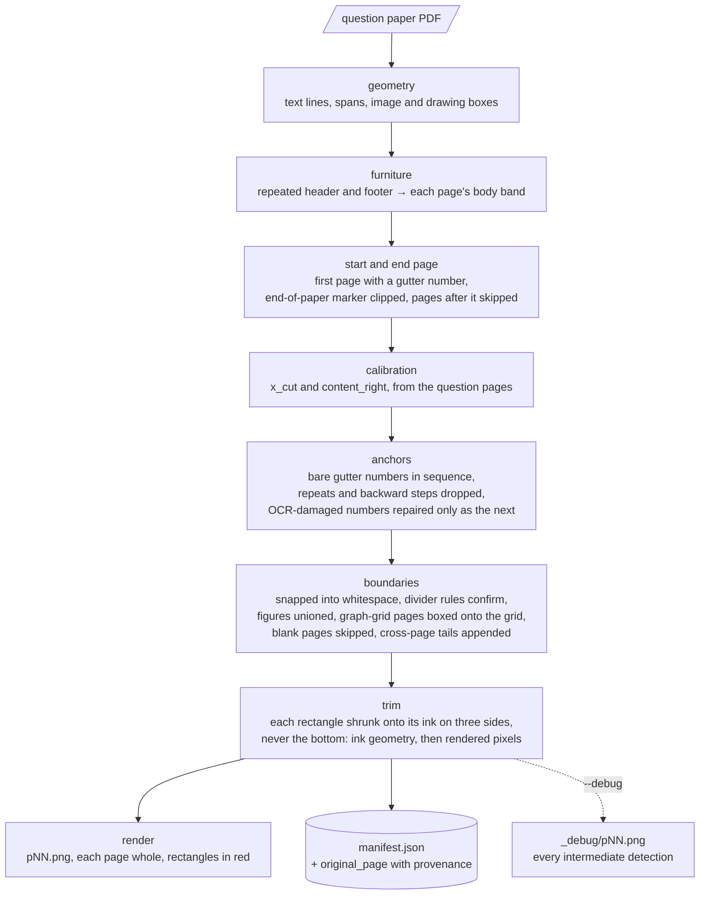
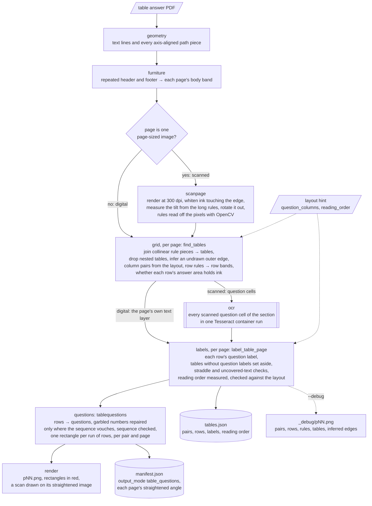

# Question Extractor

Finds each question in a digital-text PDF exam paper, or in a table-format answer key
(digital or scanned, `--table`), and records the rectangle it occupies, in PDF points,
in `manifest.json`.

**It does not crop.** Every question page is rendered whole with each question's
rectangle drawn on it in red, so boundaries can be checked by eye. Switching to real
crops is a change confined to `render.py`.

```
output/<paper>/pNN.png          # page NN, whole, with its question rectangles drawn
output/<paper>/manifest.json
output/<paper>/_debug/pNN.png   # with --debug
```

## Usage

```bash
python -m question_extractor paper.pdf --output-dir output/
python -m question_extractor samples/ --output-dir output/ --recursive
python -m question_extractor paper.pdf --output-dir output/ --start-page 3 --debug
```

| Flag | Purpose |
|---|---|
| `--output-dir` | Root for per-paper folders (default `output`) |
| `--start-page N` | 1-based first question page; inferred by default |
| `--zoom` | Render scale, 3.0 ≈ 216 dpi (default 3.0) |
| `--debug` | Also write `_debug/` renders of every intermediate detection |
| `--recursive` | Search a folder input recursively |
| `-v` | Debug-level logging |

The reasoning and measurements behind each rule below live in that module's docstring
and in `config.py` (`ExtractConfig`), where every threshold is defined. The config a run
used is written into its manifest.

## How it works

The stages, in the order `pipeline.py` runs them; each depends only on those above it:



**Two x-values, calibrated per paper** (`calibration.py`). Question numbers sit in a
left gutter, everything else in a content column. Clustering each line's leading-token
x-position gives two clusters; **`x_cut`**, the gap between them, is the crop's left
edge — the number falls left of it, part labels `(a)` right of it. **`content_right`**
is a page-wide right margin, so far-right answer lines and `[2]` mark brackets stay
inside. Both are limits; the trim decides where the crop actually lands.

**Anchors** (`anchors.py`, `tokens.py`). An anchor is a bare number (`^\d+\.?$`)
**in the gutter** — `11` inside a content line is ignored. Numbers that repeat or go
backwards are dropped with a warning; a jump is reported as a possibly missed anchor.
An OCR-garbled gutter number (`t3`, `l0`) is repaired only when it is exactly the next
number in the sequence, and always warned.

**Boundaries land in whitespace** (`boundaries.py`). An anchor is a poor place to cut —
a number centred against a display fraction sits below the fraction's numerator. Each
boundary is snapped into the gap above the next anchor: a divider rule in the gap wins;
otherwise the gap's midpoint if the gap is modest; otherwise just above the anchor,
since a large blank is answer space belonging to the question above. The last question
on a page ends at the divider below it, else the body band's bottom.

**Running headers and footers** (`furniture.py`) are found by repetition — same height,
same digit-normalised text prefix, on most pages — and define each page's body band. A
page's lowest row inside the outer margin is also caught as a footer after only a few
pages, for footers printed on one side only. A bare number with text to its right is an
anchor, never furniture. The height bucket cannot be loosened: dropping it deletes
question content from 82 of 111 papers.

**Figures and dividers** (`figures.py`). Image and drawing boxes are unioned into the
question they overlap, never left of `x_cut` or into a neighbour. Divider rules —
grouped from abutting fills — are excluded from that union and used only to confirm a
boundary.

**Graph-grid pages** (`gridpage.py`). A page that *is* graph paper — two families of
long, evenly spaced rules covering most of the body band — is boxed onto the grid
itself (plus `crop_pad`), past the text margins and body band where the grid reaches.
Its rules are not read as dividers, and it is the one page whose bottom is trimmed: the
grid is the writing space.

**Trimming** (`trim.py`). After boundaries settle, each rectangle shrinks onto its own
ink on three sides — **never the bottom**, which is the candidate's answer space. It
only ever shrinks, so it cannot move content between questions. Two passes, in order:

1. **Ink geometry** — span and figure boxes, ignoring the gutter number (read per
   character, so an OCR run like `10 (a)` drops only the number) and divider rules.
2. **Rendered pixels**, inside that box, with a near-white ink threshold so pale grids
   and shaded boxes survive.

Pixels alone fail: over an untrimmed crop they stop on the gutter-number sliver and the
divider rule, gaining nothing on 36 of 78 edges. On a **scan** (a page-sized image, no
vector paths) the geometry is blind to drawings, so pixels are also scanned over the
untrimmed band and unioned in, ignoring rows thinner than `trim_min_ink_span` (scanner
specks) and the first `trim_gutter_inset` points (the gutter sliver). Such bands are
marked `pixel_ink`. The untrimmed boundaries are kept as `partition_y0`/`partition_y1`.

**Cross-page questions.** A page with content above its first boundary, or with no
anchor, opens with the previous question's tail; that band is appended to it. One image
per page, never split by part. The test is against the boundary, not the anchor's top,
so a fraction above its centred number stays with its own question.

**Non-question pages** (`pagekind.py`). A page with no anchor whose body is empty, or
whose short text *is* a blank-page marker, is skipped with `skip_reason` and not flagged.
A blank page closes the open question. The **end-of-paper marker** (`END OF PAPER` and
variants, length-capped) is clipped from its page's body band, and every page after it —
answer keys, second papers, marking schemes — is skipped. Calibration is confined to the
paper too, since a marking scheme's margin drags `x_cut` off the gutter.

**Start page.** `--start-page` if given, else the first page with a gutter number — a
cover or formula sheet produces no anchors.

**Source provenance** (`provenance.py`). `extract_paper` takes an optional
`SourceProvenance`: the original PDF and a map from each page of this PDF to its page
there. It affects no detection; the manifest gains a `provenance` block and an
`original_page` beside every page number. Without it the manifest is unchanged. A map
that disagrees with the document is warned, and unmapped pages report their own number.

```python
source = SourceProvenance(Path("whole_booklet.pdf"), {1: 7, 2: 8, 3: 9})
extract_paper(Path("section.pdf"), Path("output"), ExtractConfig(), provenance=source)
```

## Answer tables (`--table`)

```bash
python -m question_extractor answers.pdf --table --output-dir output/ \
    [--question-columns 0,2] [--reading-order down|across] [--debug]
```

Reads a **table-format answer PDF**, digital or scanned: a ruled key or marking scheme
whose question numbers sit in a column of their own (`5(iii)`), often in two column
groups side by side. Each question gets one rectangle per run of its rows, in the same
`manifest.json` shape as a question paper:

```
output/<paper>/pNN.png         # page whole, each question's rectangles in red
output/<paper>/manifest.json   # questions and rectangles, output_mode "table_questions"
output/<paper>/tables.json     # the row-level reading behind them, in PDF points
output/<paper>/_debug/pNN.png  # with --debug: pairs, rows, rules, table boxes, inferred edges
```

`--question-columns` and `--reading-order` are the section's **layout**: the 0-based
indices of the columns holding question numbers, and which way the answers read. The
ingester passes the segmenter's (`ingester/README.md`); without them both are measured.
The pipeline shares geometry, furniture, tokens and the config with the question
pipeline, but not calibration: a table rules its own question column. `tables.py`,
`scanpage.py`, `ocr.py` and `tablequestions.py` hold the reasoning, and `ExtractConfig`'s
`table_*`, `scan_*` and `ocr_*` fields hold the measurements. The stages, in the order
`tablepipeline.py` runs them:



In outline:

- **Rules are joined first.** Real keys draw each rule cell by cell with 0.5pt gaps, so
  collinear pieces are merged before anything is measured. `geometry.py` supplies every
  axis-aligned path piece (`rule_segments`): lines, thin fills, and the sides of stroked
  rectangles.
- **A scanned page is straightened and its rules read off the pixels** (`scanpage.py`).
  Ink touching the image edge (a scanner border) is whitened; the tilt, the median angle
  of the long rules (up to 1.55° on the samples), is rotated out about the page centre;
  a morphological opening keeps ink at least 25pt long, and each piece is fitted with a
  straight centre line. Everything read off a scan is in the **straightened** page's
  points, and its `straightened.angle_deg` is recorded per page.
- **A table is a set of touching rules.** Its **column edges** are its long verticals.
  A graph drawn inside one cell joins the table but runs one row, not most of the table.
  An outer edge left undrawn (the scanned key with no right border) is inferred where
  most of the row rules end together. A table inside another's box is ignored.
- **The layout names the question columns; the content checks it.** Question column
  *k* runs from edge *k* to *k+1*, and its answers on to the next question column or the
  table's edge, so `Marks`/`Remarks` belong to the answer. A table whose indexed column
  does not mostly hold question labels (Bedok's `Year | Level` box) is set aside. With no
  layout, edges pair left to right, narrow question column then wider answer column.
- **Each pair is its own row stack.** Pairs need not share a row grid or a height. A
  **row rule** spans the whole pair, *question column included*, which is what rejects
  an underline in an answer cell.
- **Scanned question cells are read by OCR** (`ocr.py`): every cell of the section, cut
  2pt inside its rules with show-through whitened, in one run of the repo's Tesseract
  container. A digital page's own text layer is used as it is.
- **Reading order is measured, then checked against the layout.** Across wins when it
  puts the labels' question numbers in order with strictly fewer inversions, down when
  down does, and a page whose measured order contradicts the layout is flagged. A tie
  falls to the layout, then to down. Down reads the page's columns of pairs left to
  right, each top to bottom, so stacked tables read in order.
- **Rows become questions** (`tablequestions.py`). A new question number starts a
  question; the same number, a part label, or an empty question cell beside an inked
  answer continues it; a blank row joins nothing; a header (`Qn`, `No.`) is skipped. An
  OCR-garbled number (`l(a)`) is repaired only where the sequence vouches for it, and
  warned. A question gets **one rectangle per run of rows** in one pair on one page,
  from the grid corner above-left of its first question cell to the bottom-right of its
  last row, so a column or page break splits it into segments. Rectangles are not
  trimmed: the rules are the edges.
- **Doubt is a review flag, never a guess.** The page is flagged when: there is no table
  (borderless); columns don't fit the layout or don't pair; a pair has no row rules;
  text crosses a row rule; a question cell holds two question numbers (a missed rule);
  text inside a table lies outside every pair (a missed edge); the reading order
  contradicts the layout; question numbers repeat, go backwards or skip one; a scan's
  tilt is past `scan_max_skew_deg`; or OCR is unavailable (Docker not running, or the
  image not built: `docker compose build tesseract`). An OCR failure keeps the grid and
  flags every scanned page; digital pages never call Docker.

## Robustness

Nothing raises where a warning will do; warnings are logged and collected into the
manifest's `warnings`, by the one context-variable collector in `warnscope.py` (also used by
`ingester`; a warning goes to the innermost open scope only).

| Situation | Behaviour |
|---|---|
| Page with no extractable text | Rendered unannotated, `needs_review` |
| Blank page, or pages past the end-of-paper marker | Skipped with `skip_reason`, rendered unannotated, not flagged |
| Anchorless content page with no question open | Warn, `needs_review`, no band |
| No anchors in the paper | Every page rendered unannotated for review, `calibration: null` |
| No distinct gutter cluster | Fall back to `content_x - pad`, `calibration.confident: false` |
| Question number sharing a line with text left of `x_cut` | Warn — the crop may clip |
| Band with no ink / degenerate rectangle | Keep it untrimmed / skip it, with a warning |
| A paper that cannot be opened | Reported; the rest of the folder still runs |

## `--debug`

`_debug/pNN.png` adds every intermediate detection (legend in `debug.py`): blue dashed
verticals for `x_cut`/`content_right`, grey dashed boxes for each untrimmed band, yellow
for header/footer, green for anchors and eligible figures, magenta for dividers, cyan for
a graph grid, orange for pixel-scan ink. The gap between grey and red is what the trim
removed.

## Layout

`pipeline.py` runs the stages in order; its docstring names them. `locate_questions`
(stages 1-6) writes nothing and returns a `LocatedPaper`; `write_renders` and
`write_question_manifest` take it and write the page images and `manifest.json`;
`extract_paper` is the three in sequence. For `--table`, `tablepipeline.py` splits the same
way: `grid_pages` (column pairs and row bands; for a scan, the straightened pages' question
cells cropped for OCR), `read_labels` (question labels from the text layer or from OCR; an
OCR failure comes back as flagged pages) and `group_questions` (rows → questions, renders,
`manifest.json`, `tables.json`); `extract_table_paper` is the three in sequence.

| Module | Stage |
| --- | --- |
| `geometry.py` | **The only module that talks to PyMuPDF extraction.** Page → `Span`, `TextLine`, `PageGeometry`. |
| `tokens.py` | Leading-token classification: anchor, part label, OCR-damaged number. |
| `furniture.py` | Running header/footer → each page's `BodyBand`. |
| `pagekind.py` | Blank pages and the end-of-paper marker. |
| `calibration.py` | `x_cut` and `content_right`. |
| `anchors.py` | Question-number anchors and sequence filtering. |
| `gridpage.py` | Graph-grid page detection. |
| `figures.py` | Figure union and divider rules. |
| `boundaries.py` | Anchors → `Band` per page → `Question` across pages. |
| `trim.py` | Shrinks each rectangle onto its ink. |
| `render.py` | `pNN.png` with red rectangles. |
| `debug.py` | The `--debug` overlay. |
| `provenance.py` | `SourceProvenance`; read only by `manifest.py`. |
| `warnscope.py` | The one warning collector (`collect_warnings`, `current_warnings`) shared with `ingester`. |
| `manifest.py` | `manifest.json`. |
| `config.py` | `ExtractConfig`, every threshold with its justification. |
| `scanpage.py` | `--table` on a scan: border whitening, straightening, rules from pixels. |
| `ocr.py` | **The only module that runs Tesseract** (in its container): scanned question cells. |
| `tables.py` | `--table`: rules → column pairs, row bands, labels, reading order. |
| `tablequestions.py` | `--table`: rows → `Question`s, one `Band` per run of rows. |
| `tablerender.py` | `--table --debug`: the row-level geometry on `_debug/pNN.png`. |
| `tablepipeline.py` | `--table`: `grid_pages`, `read_labels`, `group_questions` (the last writes `manifest.json` and `tables.json`); `extract_table_paper` runs them. |
| `cli.py` / `__main__.py` | The command line. |

Public surface: `ExtractConfig`, `extract_paper`, `locate_questions`, `LocatedPaper`, `Band`, `Question`, `PageResult`,
`Calibration`, `PaperResult`, `SourceProvenance`, `ExtractionError`; for `--table`,
`extract_table_paper`, `grid_pages`, `read_labels`, `group_questions`, `GridPages`, `TableLayout`, `TablePaperResult`, `TablePage`, `ColumnPair`,
`RowBand`.

## Verifying a change

There is no test suite. Run the sample set before and after, and diff the manifests —
question counts, band and crop coordinates, `warnings`, `needs_review`, `skip_reason`:

```bash
python -m question_extractor samples/ --recursive --output-dir output/ --debug
```

`samples/` holds six synthetic papers under `s4_a_math/`, each named for the features it
exercises, plus `ACSBR 2024 4E5N Prelim Math P1 QP.pdf` (22 pages → 25 questions,
`x_cut=79.2`, `content_right=555.0`, page 22 skipped as blank, one warning on Q25).
`samples/answer_tables/` is a table key; the question run's output for it means nothing.

For `--table`, split the samples and read every table answer section with the layout its
fixture gives, then diff each `manifest.json` (questions, rectangles, `needs_review`)
and `tables.json` (pairs, row bounds, labels, `reading_order`). The scanned sections need
Docker running and the Tesseract image built (`docker compose build tesseract`):

```bash
python -m ingester split samples/ --recursive --output-dir split/
python -m question_extractor split/<paper>/_split/a1.pdf --table --output-dir tables/ \
    --question-columns 0 --reading-order down --debug
```

Or let the ingester route them all: `python -m ingester ingest samples/ --recursive`.

| Section | Expected |
|---|---|
| `coverpage_formulae_footer_funnyheader_endofpaper` a1 (FMS), `[0,2]` across | 12 questions from 2 pairs × 13 rows; Q5 in two segments; p1 flagged: the key prints no Q6 |
| `coverpage_formulae_numberheader_footer_blankpage_graphgrid` a1 (CCHMS), `[0,2]` down | 12 questions, pairs of 22 and 10 rows |
| `coverpage_formulae_blankpageinmiddle_endofpaper` a1, scanned, `[0]` down | 13 questions, the right edge inferred on every page; p5 flagged (a broken row rule between 7(ii) and 7(iii)) |
| `2024 S2 M (G3) EOY - Bedok View` a1/a2, scanned, `[0]` down | 14 and 9 questions, none flagged |
| `2024 S2 M (G3) EOY - Yuying` a1/a2, scanned, `[0]` down | Q1-Q11 and Q12-Q18; `l(a)` repaired to Q1, warned |
| `2024 S2 M WA1 Nan Hua` a1, `[0,2]` across | 7 questions; the blank pair-2 cells join none |
| `2026 S1 M WA3 Prac 2 Clementi Town - Chap 4,5,6,7` a1, `[0]` down | 10 questions, Q5 split across the page break |
| `answer_tables/two_pairs_column_break`, `[0,2]` down | 15 questions, Q4 split across the column break; p2 flagged (reads across), p4 flagged (borderless) |

`generate.py` beside the synthetic key rebuilds it. None of the samples fires the
straddle or uncovered-text flags. They were checked on throwaway tables, so a change to
them needs a broken table built to test it.

**The 111-paper corpus behind the thresholds was removed from the repository.** Its
figures cannot be reproduced here; treat them as recorded evidence, and do not loosen a
threshold because the remaining samples still pass. On it: 839 questions, no paper
raising, and 11 scanned papers degrading to `calibration: null` by design.

## Known issues

- **Ragged gutter.** `2025 Sec 1 Math WA1 (G3) Serangoon Garden Sec` prints its numbers
  at x = 66–95, so no single `x_cut` fits and Q3 is lost. It needs its own treatment,
  not a wider calibration sample.
- **Drifting watermark footer.** Four papers (Anglican High, Bedok View, Greendale,
  Hua Yi) keep an OCR'd `Partner In Learning` watermark in the body band: neither
  repeated text nor a trailing row. It needs a third signal; every looser threshold
  measured deleted more question content than it rescued.
- **Ruled answer lines read as dividers.** 23 pages in 8 corpus papers carry stacks of
  thin rules <12pt apart, and a boundary can snap to one. The fix is to require a
  divider to be *isolated*, not to loosen `divider_min_width_frac` — unattempted
  because it moves every boundary and the corpus to judge it is gone.
- **Printed dividers on scans** would be pixels the trim's fallback does not exclude.
  No sample exercises it.
